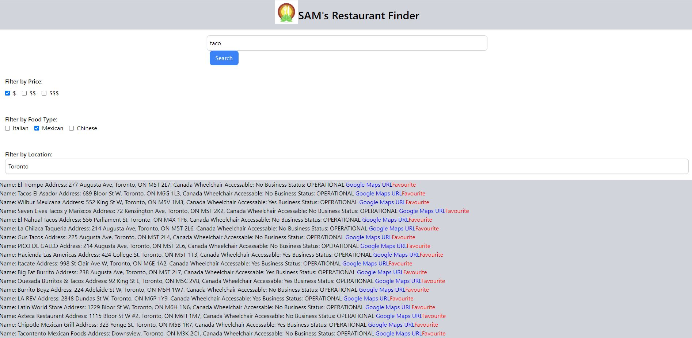

# SAM's Resturant Locator

[Project 1 for Sarah Naveed, Ariana Vinamagua, and Max Walent]

<a href=''>Deployed Link</a>

## Description

An app to show you restaurants in an area that match user provided criteria. TBD: A favourite function to save restaurants the user is interested in or like to eat at.

## License

MIT License

Copyright (c) [2023] [Team SAM (Sarah Naveed, Ariana Vinamagua, and Max Walent)]

Permission is hereby granted, free of charge, to any person obtaining a copy
of this software and associated documentation files (the "Software"), to deal
in the Software without restriction, including without limitation the rights
to use, copy, modify, merge, publish, distribute, sublicense, and/or sell
copies of the Software, and to permit persons to whom the Software is
furnished to do so, subject to the following conditions:

The above copyright notice and this permission notice shall be included in all
copies or substantial portions of the Software.

THE SOFTWARE IS PROVIDED "AS IS", WITHOUT WARRANTY OF ANY KIND, EXPRESS OR
IMPLIED, INCLUDING BUT NOT LIMITED TO THE WARRANTIES OF MERCHANTABILITY,
FITNESS FOR A PARTICULAR PURPOSE AND NONINFRINGEMENT. IN NO EVENT SHALL THE
AUTHORS OR COPYRIGHT HOLDERS BE LIABLE FOR ANY CLAIM, DAMAGES OR OTHER
LIABILITY, WHETHER IN AN ACTION OF CONTRACT, TORT OR OTHERWISE, ARISING FROM,
OUT OF OR IN CONNECTION WITH THE SOFTWARE OR THE USE OR OTHER DEALINGS IN THE
SOFTWARE.

# To Be Deleted/Moved Later
Proj Description: 
	What does it do 		-  Locates resturants in the area, like resturants you are interested in
	What is it's purpose	- Lets workers find resturants for lunch in their area

User Story: 
	As a hungry worker. I don't have time to walk around looking for resturants
	I want to find resturants for lunch within a distance, with a type of food I am interested in
	so that I'm no longer hungry
	

I want to be able to find resurants in my area
I want to be able to sort these resurants by food type
I want to be able to sort these resurants by price point
I want to be able to sort these resurants by distance from me
I want to be able to sort these resurants by good reviews

I want to be able to like resturants that look good and save my likes for later

I need the app to track my location to find resurants in my area.
	User could input their location
	
I want to know if the resurant has any websites / contact info
I want to know if the resurant uses uber eats / skip the dishes etc

Alt options to search besides resturants (community centers, parks, schools, washrooms)

User story:
Who, what, why

'start search' button
modal window pops up with options

Daily Scrum (2min per person)
	what have I completed up to the moment
	what am i going to work on today
	am i facing any show stopper issues
	
	
Recomend doing 2 scrums (1 morning ~9:30/10:00 and one at 2:15)

Server side APIs
	JQuerry
	Google Maps
	
CSS library	
	Tailwind CSS
	
Use localStorage
	For liked resturants

